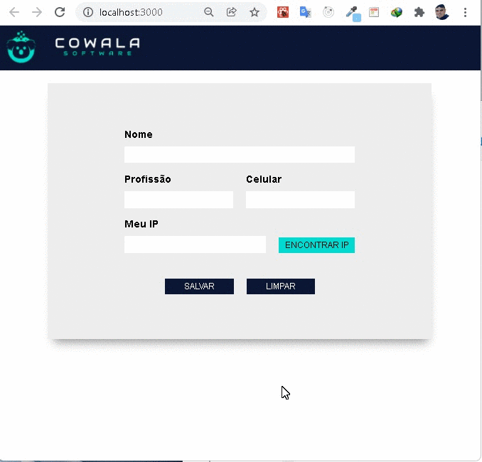

## COMO RODAR O PROJETO
- clone o respositorio 
<pre> 
git clone https://github.com/ellsonmendesyt/cowala-react.git
</pre>

- Instale as dependencias e depois rode o projeto
<pre>
 yarn install
 yarn start
</pre>

